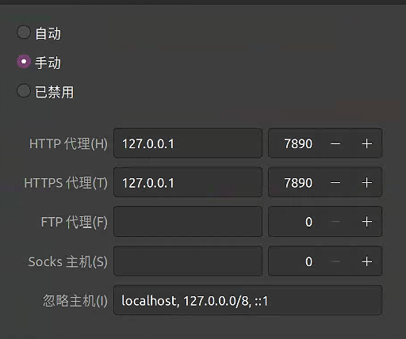

# linux-clash-gui 中文的版本
## 文件
```bash
https://drive.google.com/file/d/1d5KYW6lvdzSE2laA4JrP7O9yXfuB8qD7/view?usp=drive_link
```
## 代理配置

## gui的运行
```bash
chmod +x cfw
./cfw

```
## 桌面快捷方式
```bash
[Desktop Entry]
Name=Clash for Windows
Comment=A Windows-style GUI for Clash
Exec="./cfw"  # 你的cfw可执行文件路径
Terminal=false  # 启动时不显示终端
Type=Application
Categories=Network;Utility; 
Icon="./cfw.png"  
StartupWMClass=Clash for Windows  
```